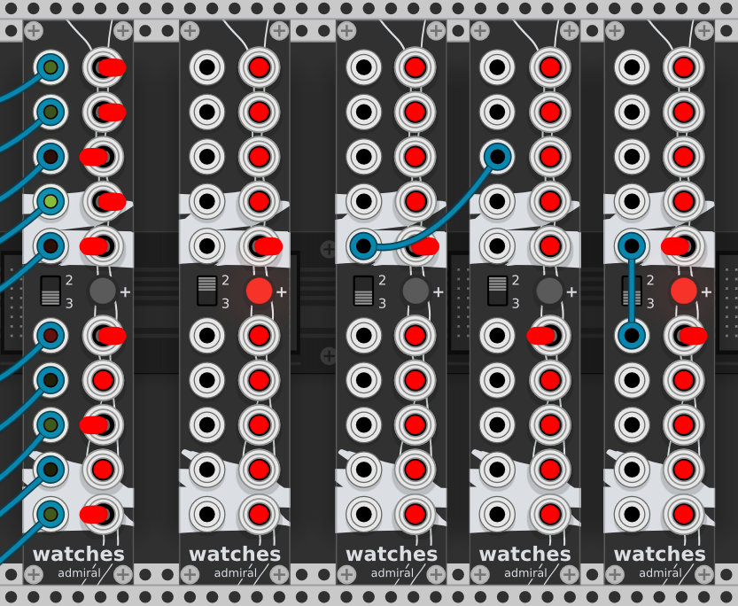

# Admiral - Modules for VCV Rack

This is a work in progress collection for Rack version 1.

## Watches - Switched Multiples

Watches has independent top and bottom sections, each is a switched
multiple with three inputs and two outputs. Each input or output jack
can be connected to the left or to the right bus using the
switches. All inputs on a bus are added together and sent to the
output jacks connected to that bus. Switches in the neutral position
mute their channels or connect them to a third bus if the `2:3` switch
is set to `3`.

`2:3` switches between **two** buses (left and right) and a mute
(middle) or **three** buses (left, right and middle).

`+` connects the buses of the upper and lower section together when
the light is lit. Watches then act as one 6>4 switched multiple
instead of two independent 3>2s.
