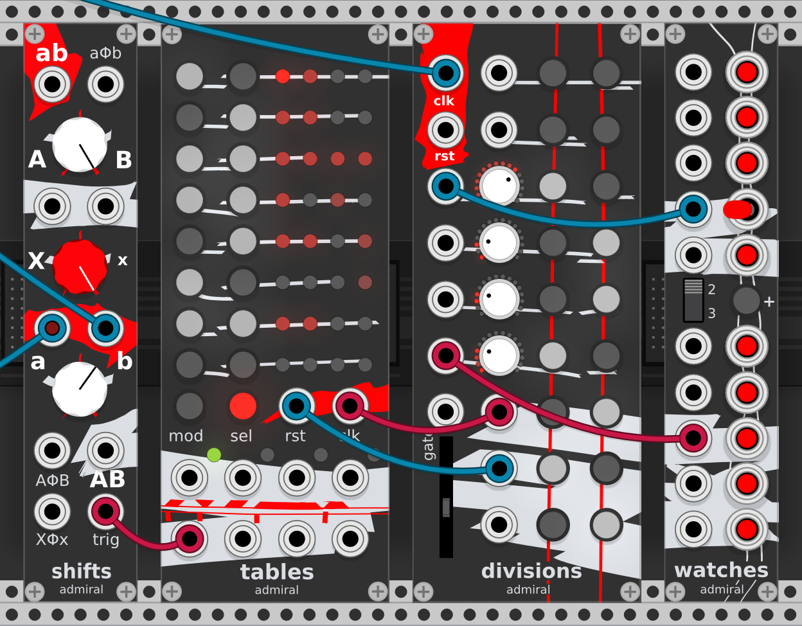
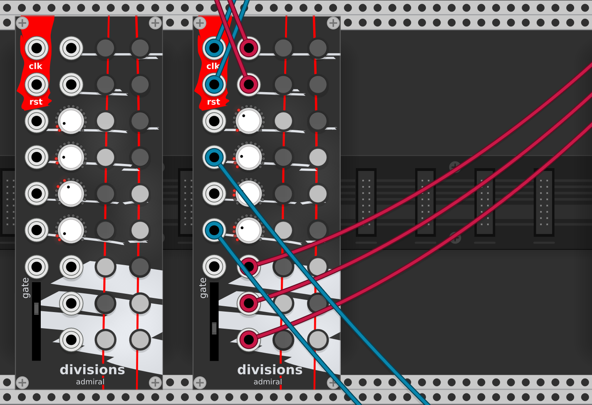
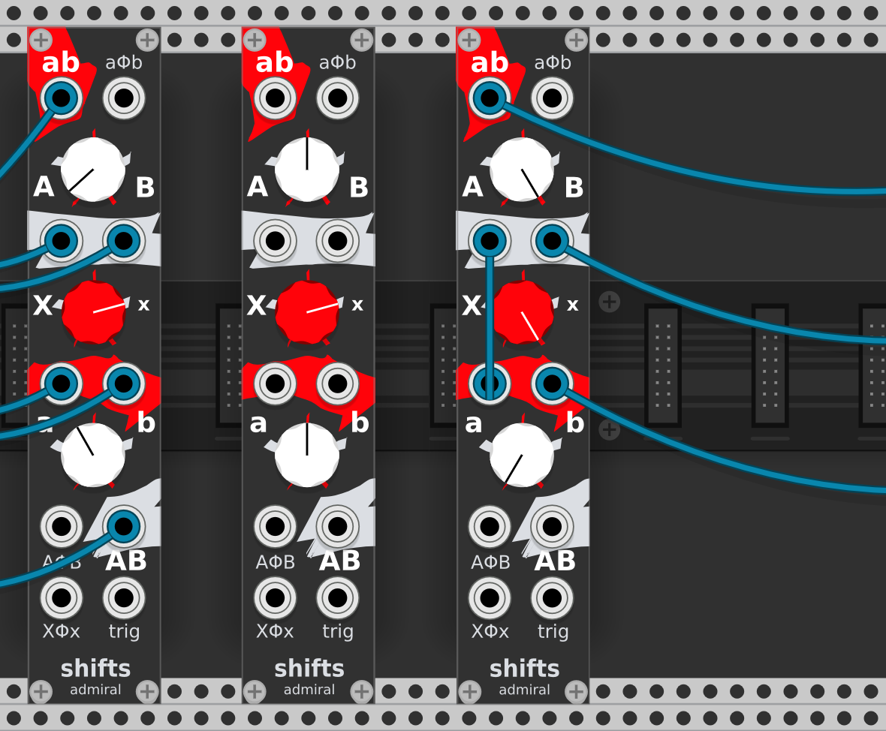
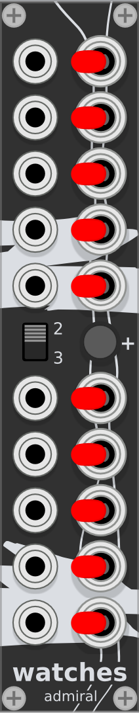

# Admiral - Modules for VCV Rack

This is a work in progress collection for Rack version 1.

## Divisions - Clock Divider and Polyrhythm Generator

Divisions is four clock dividers and two auxiliary inputs that act as
trigger sources. Each trigger can be routed to one or both of the available
buses, and the slider controls the gate length.

The module has three outputs towards the bottom that will be high when their
selected buses are high.

The four clock dividers can be controlled by CV (0 - 10V) and if a jack is
connected the knobs will act as attenuators to limit the range of the clock
division.

## Shifts - Hybrid Bernoulli Mixer

Shifts is a hybrid mixer and Bernoulli gate. Each knob mixes linearly
between two things as long as the knob is in the top part. When going
beyond the gray markers and pointing the knob down it starts acting as
a Bernoulli gate letting the other side take over more and more.

When a knob is in the Bernoulli zone it will always fully choose one
of its two channels: deciding which one by flipping a coin at each
trigger from `trig` if connected or from `ab` if not. The probability
of the coin toss is skewed according to the position of the knob. This
is how all three knobs of the module work.

**The top section** distributes `ab` or pans it between `A` and `B`
according to the top knob and can be modulated with +/-5V CV through
`aΦb`. This can act like **a panner** or a **standard Bernoulli
gate**.

**The middle section** controls the input of the bottom section. The
two options are `x` for using the external `a` and `b` inputs or `X`
for using the outputs from the top section `A` and `B`. The knob acts
the same way as the other knobs so it is possible to mix between the
top section `X` and the external input `x` either linearly or randomly
shifting from one to the other using Bernoulli gates. Both the `A`/`a`
and `B`/`b` mix will be affected the same and can be modulated with
+/-5V CV through `XΦx`. This can act like **a send-return** to two
different effects or **a simple mixer.**

**The bottom section:** `AB` is mixed from `a` and `b` according to
the top knob and can be modulated with +/-5V CV through `AΦB`. `AB` is
a linear mix of `a` and `b` or shifts from one to the other if the
knob is in the Bernoulli zone. This can act like **a mixer** or a
**reversed Bernoulli gate**.

## Tables - Quad Sequencer

Tables is four sequencers in one module. Inspired by the Metropolis and
the Ryk M-185, Tables focus is more on the rhythm and randomness
control than on the melody.

Tables has two rows of outputs, the top one are the main gates for the
four sequencers and the bottom one emits a trigger for each sequencer
when it goes from one stage to the next.

Each of Tables' four sequencer has eight stages than can be programmed
using the buttons in the `mod` and `sel` columns. The bottom `sel`
switches between sequencers: the green light indicates which one is
currently being programmed.

### Selection

The top eight `sel` buttons select which and how many steps the
corresponding stage will use. This is indicated by how many lights
become dimly lit in the stage.

Each stage will take as long as there are active steps in it. The
maximum number of steps is four. When steps have empty lights in
front of them in the pattern the number of empty slots indicates
the probability of that step being muted. The total time a stage
takes doesn't change with this randomness, only the gates being
outputted during the stage do.

In general the probability a step will play is `1 / (1 + number of
empty spaces)`. How this interacts with Stage Modes is explained in
the Stage Modes section below.

### Modes

The `mod` column of buttons are used to switch between four modes for
each stage and between four modes for the sequencer itself. Which mode
is currently being used is represented in binary by lighting the `mod`
and neighboring `col` buttons.

Let's list all the possible modes:

#### Stage Modes

These modes are chosen with the `mod` buttons in front of the eight
stages.

  - `. .`: **wait** mode will simply wait during the given amount of
  steps. Randomness in stage selection has no effect in this mode.

  - `@ .`: **first** mode will only output a gate for the first step
  in a group of adjacent steps. This allows for a short pulse with the
  number of steps after it being the amount of time we wait before the
  next stage. Randomness requires gaps in the pattern and will cause
  this mode to output multiple gates in a single stage.

  - `. @`: **all** mode will output a gate for each step in the stage.
  Randomness has the effect of muting the gate directly after the gap.

  - `@ @`: **join** mode will output a gate as long as a group of
  adjacent active steps. Randomness has the effect of muting each
  group of steps according to the probability indicated by the size of
  the gap in front of it.

#### Channel Modes

This mode is global for each of the four sequencer and is chosen using
the bottom `mod` button.

  - `. .`: **forward** simply iterates over all stages in order top to
  bottom and then cycles starting from the top again.

  - `@ .`: **random** picks a random next stage each time one is
    finished, it is possible it picks the same one again.

  - `. @`: **brownian** has a 50% chance of picking the next stage,
  25% chance of repeating the same stage, and 25% chance of picking
  the stage above the current one.

  - `@ @`: **reverse** iterates over all stages from the bottom to the
  top then cycles starting from the bottom again.

## Watches - Switched Multiples

Watches is a passive multi-connector similar to a classic multiple.
What's different is that each socket has a 3-position switch to
connect the jack to one of three internal buses.

All **inputs on a bus are added together and sent to the output
jacks** connected to that bus.

The top section has three inputs and two outputs, the bottom section
is the opposite and has two inputs and three outputs.

Normally Watches is separated in a top and bottom section that act
independently. When the `+` button is red the top three buses are
connected to their bottom counterparts and the module act as one.

The **neutral switch position** connect jacks to the middle bus.
The middle bus is special and acts differently according to the `2:3`
switch:
  - On `2` only two buses are active, the middle bus mutes.
  - On `3` the middle bus is independent in each section.
  - In between the middle bus is shared between the two sections even
    when `+` is not active and they otherwise act independently.
